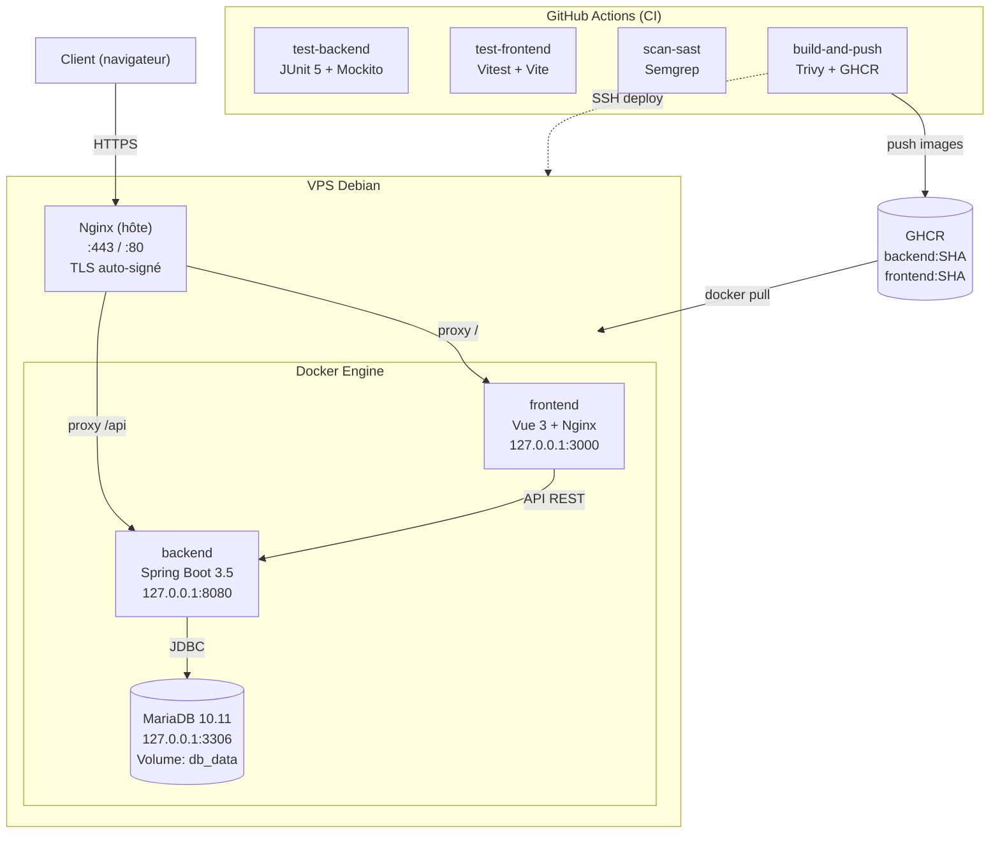

# DevFolio

Application portfolio étudiant : Spring Boot 3.5 + Vue 3 + MariaDB.

Projet pédagogique de sécurisation OWASP et de CI/CD.

[](https://spring.io/)
[](https://vuejs.org/)
[](https://mariadb.org/)
[](https://www.docker.com/)
[](https://openjdk.org/)
[](https://github.com/features/actions)
[](https://owasp.org/)

> Les clés et identifiants présents dans le dépôt sont **fictifs** (exemples AWS, mots de passe de test). En production, tous les secrets doivent être externalisés et les credentials révoqués si compromis.

## Branches

| Branche | Description | Contenu |
|---------|-------------|---------|
| `main` | Version vulnérable originale | Code de départ pour l'audit de sécurité (Kit 1) |
| `correction` | Version sécurisée + CI/CD complet | Corrections OWASP Top 10 2025 + pipeline CI/CD (Kit 1 + Kit 2) |
| `ci-cd-pipeline` | Branche de travail historique | Identique à `correction` depuis le merge. Conservée pour l'historique Git du Kit 2 |

> `correction` et `ci-cd-pipeline` contiennent désormais le même code. La branche `ci-cd-pipeline` peut être supprimée si souhaité, tout le travail est dans `correction`.

## Architecture



> **Note sur `127.0.0.1`** : les conteneurs Docker (frontend, backend, MariaDB) sont
> bindés sur `127.0.0.1` (localhost du VPS), pas sur une IP publique. Seuls les ports
> 80 et 443 du Nginx hôte sont exposés vers internet (via UFW). Les ports 3000, 8080
> et 3306 ne sont jamais accessibles depuis l'extérieur.

## Stack technique

| Couche | Technologie |
|--------|-------------|
| Backend | Spring Boot 3.5, Java 21, Maven, JWT (jjwt) |
| Frontend | Vue 3, Vite, Bootstrap 5 (CDN avec SRI) |
| Base de données | MariaDB 10.11 |
| Containerisation | Docker, Docker Compose |
| Reverse proxy | Nginx (TLS auto-signé) |
| CI/CD | GitHub Actions, GHCR |
| Scan sécurité | Semgrep (SAST), Trivy (images Docker) |
| Sécurité VPS | fail2ban, UFW, SSH key-based |

## Démarrage

### Développement local

```bash
cp .env.example .env   # Éditer .env avec vos propres valeurs
# Important : en production, définir CORS_ALLOWED_ORIGINS=https://<votre-domaine>
docker-compose up --build
```

> **Guide détaillé** (prérequis Docker, champs `.env` obligatoires, ports, dépannage) : voir [docs/installation-pas-a-pas.md](docs/installation-pas-a-pas.md#développement-local-sans-vps)

### Déploiement sur un VPS (production)

Deux scripts automatisent le déploiement initial sur un VPS Debian/Ubuntu :

| Script | Rôle | Quand | Exécuté par |
|--------|------|-------|-------------|
| `hardening.sh` | Durcit le serveur (SSH, UFW, fail2ban, DOCKER-USER, utilisateur `deploy`) | Une seule fois, avant le premier déploiement | `root` (via `sudo`) |
| `deploy.sh` | Clone le repo, crée `.env`, build et démarre les conteneurs | Une seule fois, après `hardening.sh` | `deploy` (pas root) |

Après le déploiement initial, le pipeline CI/CD (`.github/workflows/ci.yml`) prend le relais : à chaque push sur `ci-cd-pipeline`, les images sont construites, scannées par Trivy, poussées sur GHCR, puis déployées automatiquement sur le VPS via SSH.

> **Guide détaillé pas à pas** (prérequis, commandes, dépannage) : voir [docs/installation-pas-a-pas.md](docs/installation-pas-a-pas.md)

### Branche `correction` / `ci-cd-pipeline` (sécurisée)

- Frontend : `https://localhost` (HTTPS avec certificat auto-signé en dev)
- Backend API : `https://localhost/api` (via reverse proxy nginx)
- Backend API (debug) : `http://localhost:8080/api` (accès direct, dev uniquement)

### Branche `main` (vulnérable)

- Frontend : `http://localhost`
- Backend API : `http://localhost:8080/api`

## Documentation

### `docs/installation-pas-a-pas.md` : Guide d'installation

| Fichier | Contenu |
|---------|---------|
| `installation-pas-a-pas.md` | Déploiement complet sur un VPS Debian/Ubuntu (prérequis, 5 étapes, dépannage) |

### `docs/securite/` : Sécurisation OWASP (Kit 1)

| Fichier | Contenu |
|---------|---------|
| `00-prise-en-main.md` | Prise en main du projet et de ses vulnérabilités |
| `01-audit-vulnerabilites.md` | Audit complet des vulnérabilités |
| `02-owasp-mapping.md` | Mapping OWASP Top 10 2025 |
| `03-plan-action.md` | Plan d'action correctif |
| `04-infrastructure.md` | Infrastructure et configuration |
| `05-installation-linux.md` | Installation sur Linux |
| `06-corriger-essentiel-demo.md` | Corrections essentielles pour la démo |
| `07-durcissement-serveur.md` | Durcissement du serveur |
| `08-deploiement-verification.md` | Déploiement et vérification |
| `09-resultat.md` | Résultats et bilan |

### `docs/ci-cd/` : Pipeline CI/CD (Kit 2)

| Fichier | Contenu |
|---------|---------|
| `00-depart.md` | Plan et architecture cible du pipeline |
| `01-infrastructure-vps.md` | Phase 1 : VPS, Nginx, Docker, `.env` |
| `02-pipeline-ci.md` | Phase 2 : Workflow GitHub Actions, jobs, secrets, tagging |
| `03-tests-automatises.md` | Phase 3 : Tests backend (JUnit + Mockito) et frontend (Vitest) |
| `04-diagramme-deploiement.md` | Diagramme de déploiement (Mermaid + ASCII + drawio) |
| `05-corrections-trivy.md` | Cycle d'itération Trivy (runs #4 à #7, 36 CVE → 0) |
| `06-deploiement-continu.md` | Phase 4 : Job deploy, SSH, healthcheck, correctifs |
| `07-fichiers-modifies.md` | Tableau récapitulatif des fichiers créés/modifiés |
| `08-resultat-vps.md` | Bilan : sécurité du VPS en production (fail2ban, UFW, clés SSH, compte deploy) |
| `diagramme-deploiement.drawio` | Diagramme UML de déploiement (diagrams.net) |
| `diagramme-deploiement.drawio.png` | Export PNG du diagramme UML |

## Tests validés (branche `correction`)

Les vérifications suivantes ont été exécutées avec succès sur le backend (accès direct `http://localhost:8080/api`, sans Docker) :

| Test | Résultat |
|------|----------|
| Injection SQL sur `/api/search/projects` | Bloquée (résultat vide) |
| JWT `alg:none` (token falsifié) | Rejeté (401) |
| Route admin sans token | 401 Unauthorized |
| Actuator `/env` sans rôle ADMIN | 401 |
| Actuator `/health` (public) | 200 OK |
| SSRF avatar avec URL interne (`169.254.169.254`) | 400 Bad Request |
| Rate limiting (5 tentatives/min sur login) | 429 Too Many Requests |
| Logout + token blacklisté | Déconnexion réussie |

Un script de vérification automatisée pour un déploiement Docker complet est documenté dans `docs/securite/08-deploiement-verification.md`.

## Tests automatisés (branche `ci-cd-pipeline`)

| Test | Framework | Couverture |
|------|-----------|------------|
| Backend : `JwtServiceTest` | JUnit 5 + Mockito | 4 tests (génération, validation, rejet alg:none, rejet secret différent) |
| Backend : `UrlValidatorTest` | JUnit 5 | 6 tests (HTTPS, whitelist, SSRF, URL malformée) |
| Backend : `AuthControllerTest` | JUnit 5 + Mockito | 7 tests (login, register, logout, rate limiting) |
| Frontend : `basic.test.js` | Vitest | 2 tests (sanity check) |

Pipeline CI : `.github/workflows/ci.yml`. Voir `docs/ci-cd/01-pipeline-ci.md` pour le détail.

## Comptes de test

| Email | Mot de passe | Rôle |
|-------|-------------|------|
| `admin@devfolio.com` | `DevfolioAdmin2024!` | ADMIN |
| `lilo@student.com` | `liloPass2024!` | USER |
| `dylan@student.com` | `dylanPass2024!` | USER |
