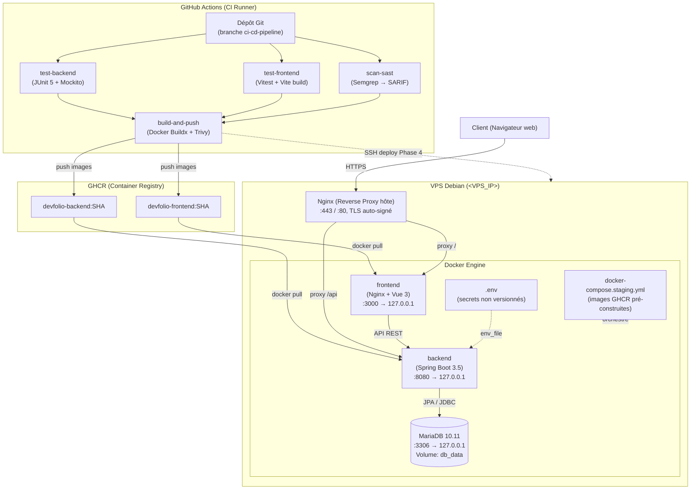

# Diagramme de déploiement

> Architecture visuelle du pipeline CI/CD et de l'infrastructure VPS.

---

## Livrables UML

- **Format modifiable** : [`diagramme-deploiement.drawio`](./diagramme-deploiement.drawio) : ouvrir avec https://app.diagrams.net
- **Image exportée** : [`diagramme-deploiement.drawio.png`](./diagramme-deploiement.drawio.png) : livrable visuel du diagramme UML

---

## Version Mermaid (rendu GitHub)



---

## Version ASCII (référence rapide)

```
┌─────────────────────────────────────────────────────────────┐
│  VPS Debian (<VPS_IP>)                                    │
│                                                             │
│  ┌──────────────┐    ┌──────────────────────────────────┐  │
│  │  Nginx (hôte)│    │  Docker Engine                    │  │
│  │  :443 / :80  │    │                                   │  │
│  │  TLS auto-   │    │  ┌─────────────┐  ┌────────────┐ │  │
│  │  signé       │───▶│  │  backend    │  │  mariadb   │ │  │
│  │              │    │  │  :8080      │◀▶│  :3306     │ │  │
│  │  /api ───────│───▶│  │  127.0.0.1  │  │  127.0.0.1 │ │  │
│  │  /    ───────│───▶│  └─────────────┘  └────────────┘ │  │
│  │              │    │       │                          │  │
│  │              │    │       ▼                          │  │
│  │              │    │  ┌─────────────┐                 │  │
│  │              │    │  │  frontend   │                 │  │
│  │              │    │  │  :3000      │                 │  │
│  │              │    │  │  127.0.0.1  │                 │  │
│  │              │    │  └─────────────┘                 │  │
│  └──────────────┘    └──────────────────────────────────┘  │
│                                                             │
│  fail2ban (sshd)  │  UFW (22/80/443)  │  Compte `deploy` (SSH)     │
└─────────────────────────────────────────────────────────────┘
         ▲
         │ SSH (déploiement Phase 4)
         │
┌─────────────────────────────────────────────────────────────┐
│  GitHub Actions (CI)                                        │
│  ├─ test-backend  (mvn clean test)                         │
│  ├─ test-frontend (vitest + vite build)                    │
│  ├─ scan-sast     (Semgrep)                                │
│  └─ build-and-push (Trivy scan + push GHCR)                │
│                                                             │
│  GHCR : ghcr.io/dylanholin/devfolio-{backend,frontend}     │
└─────────────────────────────────────────────────────────────┘
```
